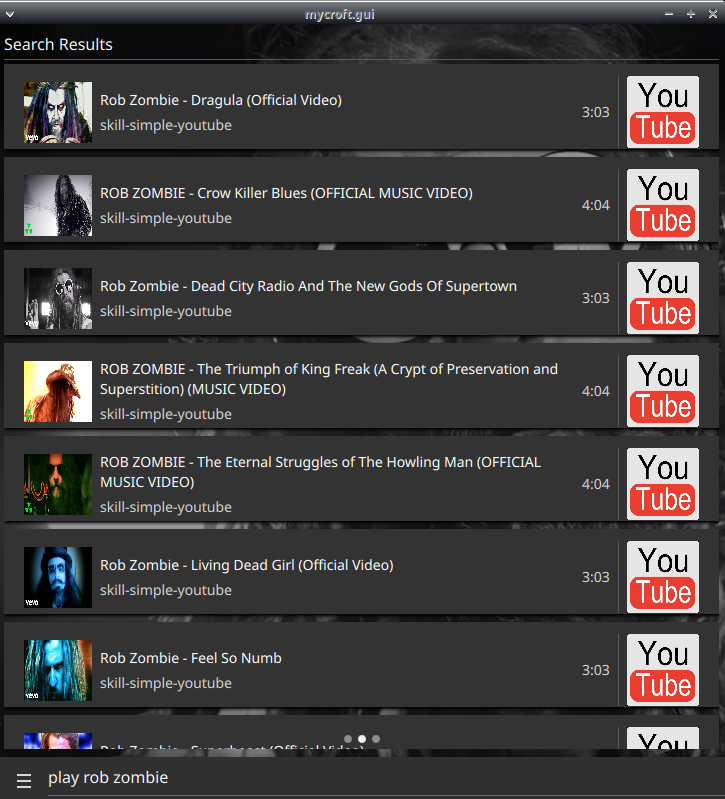
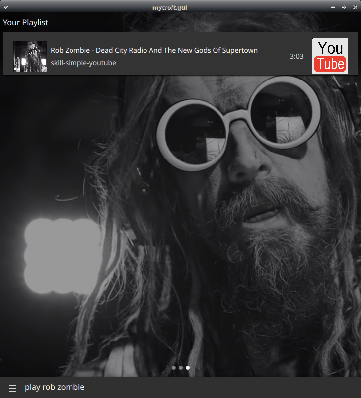

#  Simple Invidious Skill

simple invidious skill for better-cps

## About

search invidious by voice!

this skill can be configured as a fallback matcher for play queries, you can set `self.settings["fallback_mode"] = True`
and returned results will have lower confidence, other skills should take precedence most of the time

built on top of [Invidious API](https://github.com/iv-org/invidious)

## Configuration

You can configure the Invidious instance to use by setting `self.settings["invidious_instance"]` to your preferred instance URL.
Default instance: `https://inv.nadeko.net`

## Examples

* "play rob zombie"
* "play freezing moon with dead on vocals"
* "play programming music mix"
* "play center of all infinity album"

## Credits

JarbasAl

## Category

**Entertainment**

## Tags

- video
- invidious
- common play
- music
